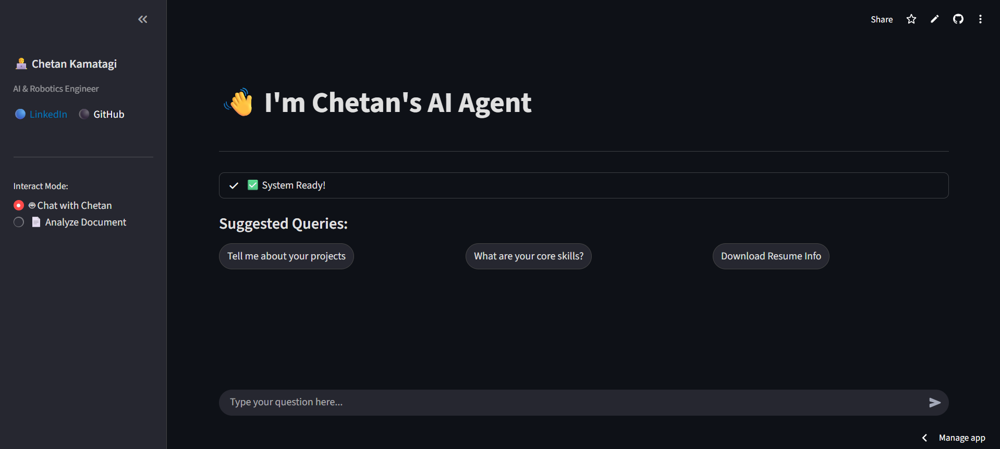
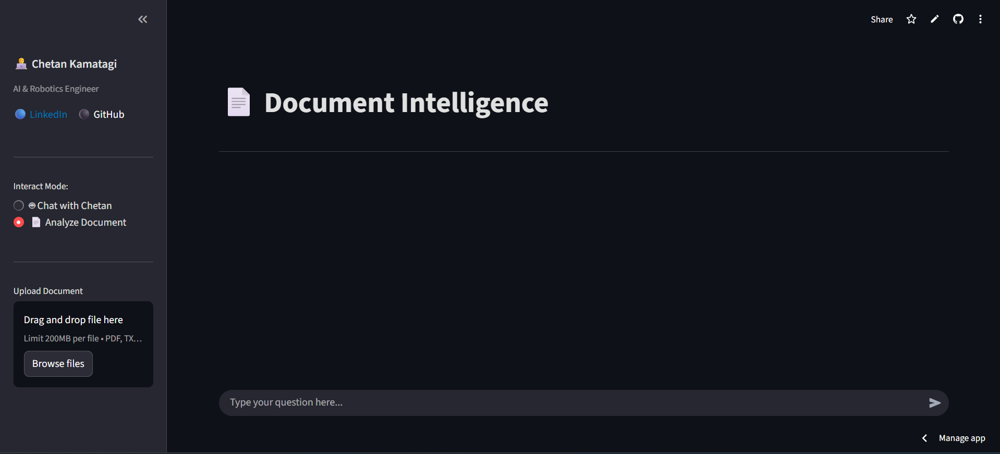

# 🤖 RAG AI Bot: Interactive Portfolio & Document Assistant


This repository contains the source code for a dual-mode AI chatbot built with a Retrieval-Augmented Generation (RAG) architecture. It serves both as an interactive portfolio for developer Chetan Kamatagi and a general-purpose document analysis tool.

🔗 **[Live Demo](https://ragaibot-rlrtcxdmjnvtwj6hw4d6gz.streamlit.app)**

---

## 📸 Screenshots

| **Dark Mode UI** | **Document Analysis** |
|:---:|:---:|
|  |  |

---

## Features

-   **Dual-Mode Functionality:**
    -   **AI Portfolio Agent:** A chatbot trained on personal resume data (`data/MyData.md`) that can answer questions about skills, experience, and projects in the first person.
    -   **Document Intelligence Mode:** Allows users to upload their own documents (`PDF`, `DOCX`, `TXT`, `MD`) and ask questions about their content.
-   **RAG Architecture:** Utilizes LangChain to build a robust RAG pipeline, ensuring answers are grounded in the provided document context and reducing LLM hallucinations.
-   **High-Performance LLM:** Integrates with the Groq API for fast, real-time streaming responses from models like Llama 3, with built-in fallbacks to ensure reliability.
-   **Local Vector Storage:** Uses FAISS for efficient, local vector similarity searches. The system maintains separate vector stores for the portfolio and user-uploaded documents.
-   **Interactive UI:** A clean and user-friendly web interface built with Streamlit.

## Tech Stack

-   **Framework:** LangChain
-   **LLM Provider:** Groq (Llama-3.3, Llama-3.1, Mixtral)
-   **Embeddings:** `sentence-transformers` (all-MiniLM-L6-v2)
-   **Vector Database:** `faiss-cpu`
-   **Frontend:** Streamlit
-   **Document Processing:** `unstructured`, `pypdf`, `docx2txt`

## System Architecture

The application operates on a "dual-brain" RAG system managed by `src/chat.py`:

1.  **Profile Brain:** A persistent FAISS vector store is created from the `data/MyData.md` file. This is the knowledge base for the "Chat with Chetan" mode. The database automatically rebuilds if the `MyData.md` file is updated.
2.  **Document Brain:** A temporary FAISS vector store is created on-the-fly whenever a user uploads a new document in the "Analyze Document" mode. This ensures data privacy and context separation between different user sessions.

### Workflow
1.  A user selects a mode and enters a query via the Streamlit interface.
2.  The application chooses the appropriate vector store ("Brain") based on the selected mode.
3.  The user's query is converted into an embedding using the `all-MiniLM-L6-v2` model.
4.  FAISS performs a similarity search to find the most relevant text chunks from the source documents.
5.  These chunks are passed as context to the Groq LLM along with a persona-driven prompt.
6.  The LLM generates a grounded answer, which is streamed back to the user interface in real-time.

## Setup and Installation

### Prerequisites
- Python 3.12
- Groq API Key

### Instructions
1.  **Clone the Repository:**
    ```bash
    git clone https://github.com/ChetanKamatagi/RAG_AI_BOT.git
    cd RAG_AI_BOT
    ```

2.  **Set Up a Virtual Environment:**
    ```bash
    python3 -m venv venv
    source venv/bin/activate
    # On Windows, use: venv\Scripts\activate
    ```

3.  **Install Dependencies:**
    ```bash
    pip install -r requirements.txt
    ```

4.  **Configure Environment Variables:**
    Create a file named `.env` in the root directory of the project and add your Groq API key:
    ```
    GROQ_API_KEY="your_groq_api_key_here"
    ```

## Usage

To run the application, execute the following command from the project's root directory:

```bash
streamlit run src/app.py
```

Navigate to `http://localhost:8501` in your web browser. You can then use the sidebar to switch between the two modes:
-   **🤖 Chat with Chetan:** Ask questions about Chetan Kamatagi's skills, projects, and experience.
-   **📄 Analyze Document:** Upload a supported document. Once indexed, you can ask questions about its content.

## Project Structure

```
.
├── data/
│   └── MyData.md         # Knowledge base for the personal AI agent
├── src/
│   ├── app.py            # Streamlit frontend UI and application logic
│   ├── chat.py           # Core RAG workflow, LLM integration, and mode handling
│   ├── embedding.py      # Document chunking and embedding generation pipeline
│   ├── load_data.py      # Handles loading of various document formats
│   └── vector_database.py # Manages FAISS vector store operations
├── requirements.txt      # Project dependencies
└── LICENSE               # Apache 2.0 License
```

## License
This project is licensed under the Apache License 2.0. See the `LICENSE` file for more details.
